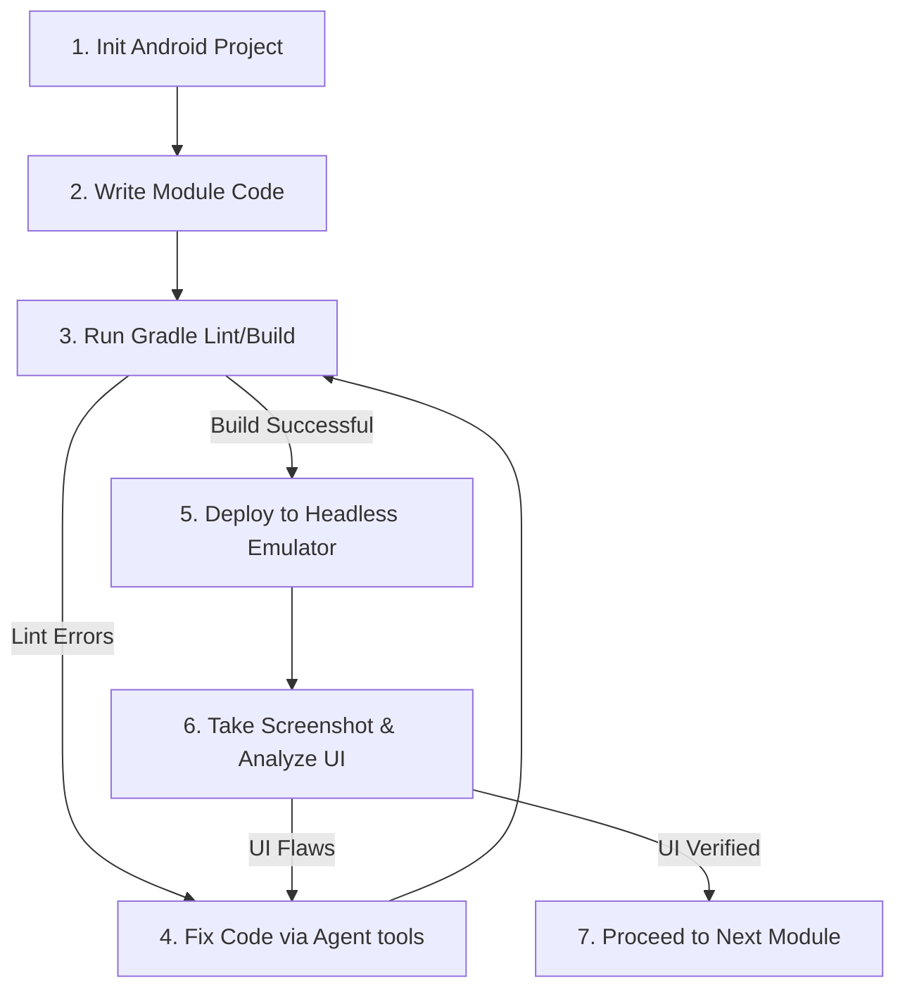

---
tags:
  - agent-protocols
  - planning
  - development
created: 2026-06-02
status: Draft
---

# AI-Led Development Plan

This document details how an AI agent (such as myself) executes the end-to-end development of the **Slim Launcher** app, from project initialization to device validation, without requiring constant manual coding from the user.

Back to **[[index|Main Hub]]** | Next: **[[subagent_delegation_tasks|Subagent Roles & Prompts]]**

---

## 🛠️ Phase-by-Phase Agent Workflow

To ensure high-quality software, the agent splits the task into distinct steps, verifying compiling and rendering correctness at each milestone.



---

## 💻 Technical Execution Commands

The agent uses bash commands to drive the compile/test lifecycle:

### 1. Build Verification
To ensure compilation succeeds and find static analysis errors:
```bash
./gradlew assembleDebug --no-daemon
```

### 2. Linting & Formatter Check
To verify syntax standards before code check-ins:
```bash
./gradlew lintDebug
```

---

## 📸 Headless UI Verification Loop

Because an AI agent cannot physically look at a mobile screen, the agent implements a visual verification loop:

1. **Deployment**: Install the compiled launcher on an active Android Emulator or connected physical device:
   ```bash
   adb install -r app/build/outputs/apk/debug/app-debug.apk
   ```
2. **Launch Launcher Activity**: Set the launcher as active or trigger its launch activity:
   ```bash
   adb shell am start -n com.slim.launcher/.MainActivity
   ```
3. **Capture & Pull Screenshot**:
   ```bash
   adb shell screencap -p /sdcard/launcher_screencap.png
   adb pull /sdcard/launcher_screencap.png ./scratch/launcher_screencap.png
   ```
4. **Visual Evaluation**: The agent views the screenshot `./scratch/launcher_screencap.png` (using vision or image evaluation capabilities) to check alignments, font scale, wave displacement curves, and spacing.
5. **Adjust Styles**: Tweak layout values or drawings in `WaveGestureView.kt` or `MainActivity.kt` based on visual analysis.

---

## 🛡️ Step-by-Step Milestones

| Milestone | Deliverables | Verification Criteria |
| :--- | :--- | :--- |
| **M1: Foundation** | Project skeleton, `AndroidManifest.xml`, dependencies, basic `LauncherApps` query. | Successful compilation with zero dependencies issues. |
| **M2: UI Shell** | `RecyclerView` and favorites list implementation. | Android Emulator shows app list scrollable list. |
| **M3: Wave Slider** | Custom `WaveGestureView` implementation with drawing mathematical offsets. | Screenshot analysis of drag displacement curves and character overlaps. |
| **M4: System Links** | Widget hosting (`AppWidgetHost`) and Notification Listener integration. | Verifying dynamic widget attachment and parsing sample notifications. |
| **M5: Features & Optimization** | Room DB caching, custom tag filters, RAM profiling (<75MB). | `adb shell dumpsys meminfo com.slim.launcher` metrics verified. |
