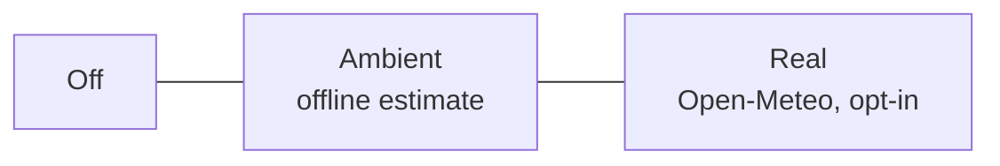

---
tags:
  - architecture
  - settings
  - features
created: 2026-06-03
status: Implemented
---

# Settings, Feature Toggles & Search Behavior

This document describes the user-configurable feature system of **Slim Launcher**: the Settings screen, the preference storage layer, the smart search panel, and the adaptive theming engine.

Back to **[[index|Main Hub]]** | Previous: **[[ui_ux_layout|UI/UX Layout & Gesture Mechanics]]**

---

## ⚙️ Settings Entry Point

Slim deliberately has **no persistent settings button** on the home screen. Instead, the launcher's own entry ("Slim") in the app list acts as the settings shortcut:

- Tapping **Slim** in the alphabetical list or search results opens `SettingsActivity`.
- Long-pressing the Slim entry does the same.
- A Settings shortcut row also sits at the very end of the all-apps list (reached by scrubbing the alphabet).

The header weather chip is purely informational — it intentionally does **nothing** on tap (it used to open Settings, but that sat right under the clock and was an easy mis-tap). This keeps the home screen at zero visual overhead while keeping settings one obvious tap away.

## 🗄️ Preference Storage (`SlimPreferences.kt`)

All options are stored in `SharedPreferences` (`slim_launcher_prefs`) behind a typed wrapper:

| Key | Type | Default | Purpose |
|---|---|---|---|
| `show_clock` | Boolean | `true` | Show/hide the header clock |
| `show_date` | Boolean | `true` | Show/hide the header date |
| `use_24_hour` | Boolean | `true` | 24-hour vs 12-hour clock |
| `weather_mode` | String | `simulated` | `off` / `simulated` (ambient, offline) / `real` (Open-Meteo) |
| `weather_city` / `weather_lat` / `weather_lon` | String/Float | — | Geocoded city for real weather |
| `weather_fahrenheit` | Boolean | `false` | °C vs °F |
| `weather_cache` / `weather_cache_time` | String/Long | — | Last fetched weather (30-minute TTL) |
| `search_history_enabled` | Boolean | `true` | Remember recently searched apps |
| `search_history` | String | — | Pipe-separated package names, most recent first (max 8) |
| `show_app_icons` | Boolean | `true` | Show icons vs. text-only minimal list |
| `background_mode` | String | `solid_black` | `transparent` / `dimmed` / `solid_black` window background |
| `immersive_mode` | Boolean | `false` | Hide status bar; show notification count + battery in header |
| `swipe_up_search` | Boolean | `true` | Enable/disable the swipe-up search gesture |
| `swipe_down_notifications` | Boolean | `true` | Swipe down to open the system notification shade |
| `comm_notifications_only` | Boolean | `true` | Surface only communication notifications on home |
| `widget_id` | Int | `-1` | Bound home-screen widget id (`-1` = none) |

## 🌦️ Weather Modes



1. **Off** — header shows clock/date only.
2. **Ambient** (default) — an offline, seasonal estimate. Clearly labeled in Settings as an estimate; makes zero network calls.
3. **Real** — the user types a city; `WeatherService` geocodes it via the Open-Meteo geocoding API and fetches current conditions (WMO code → emoji + description) at most every 30 minutes. Requires the `INTERNET` permission, which is used for nothing else.

## 🔍 Search Panel Behavior

The floating search panel (swipe up to open) consists of three stacked elements, all rendered **above** the dim scrim so results are unmistakably tappable:

```
+--------------------------------------+
|  [🔍  Search apps…              ]    |   <- input box
|  ( Chrome ) ( Maps ) ( Spotify )     |   <- recent-search quick chips
|  ───────────────────────────────     |
|  ▸ Calendar                          |   <- live ranked results
|  ▸ Calculator                        |
+--------------------------------------+
            dimmed wallpaper             <- scrim (below panel)
```

### Result ranking
Matching is case-insensitive against **any part** of the app label, ranked:

1. Label **starts with** the query (`cal` → *Calendar*)
2. Any **word** in the label starts with the query (`dri` → *Google Drive*)
3. Label **contains** the query anywhere (`mer` → *Camera*)

Ties within a rank are sorted alphabetically.

### Recent searches
When an app is launched *from search* (results or chips), its package is pushed onto the history (max 8, deduplicated). The chips row shows these apps whenever the search panel opens with an empty query — instant re-launch without making them favorites. The feature can be disabled or cleared in Settings.

## 🎨 Adaptive Theming

The launcher draws directly on the system wallpaper, so readability is handled at runtime:

1. `WallpaperManager.getWallpaperColors()` is queried on every resume.
2. On Android 12+, the `HINT_SUPPORTS_DARK_TEXT` color hint decides between the light-text and dark-text palettes; older versions fall back to a luminance check of the wallpaper's primary color.
3. The accent color uses **Material You** (`system_accent1_200`) on Android 12+, indigo otherwise.
4. Header text carries a subtle shadow so it stays legible even on busy wallpapers.
5. The alphabet index (`WaveGestureView`) and home app list receive the same adaptive palette; the search panel keeps fixed light-on-dark colors since it has its own dark surface.

## 🧭 Gesture Rules

| Gesture | Context | Action |
|---|---|---|
| Swipe up | Home (favorites) state | Open search panel (if enabled in Settings) |
| Swipe up | Alphabet browsing / scrubbing | **Nothing** — scrolls the list normally |
| Swipe down | Home (favorites) state | Open the system notification shade (if enabled) |
| Touch starting on alphabet index | Anywhere | Letter scrubbing only; never triggers search |
| Horizontal swipe | Alphabet browsing | Return to favorites |
| Back press | Search open | Close search |
| Back press | Alphabet browsing | Return to favorites |
| Back press | Home (favorites) state | **Nothing** — the home screen is the bottom of the nav stack and never finishes |
| Long-press app | Any list | Options: favorite, rename, hide |

> [!NOTE] Back never exits the launcher
> Back is handled through an always-enabled `OnBackPressedCallback` (not the legacy `onBackPressed`), so it behaves correctly under predictive-back gestures too. At the home state it is *consumed* — the home Activity is never finished. Letting it finish is what caused some OEM ROMs (notably OnePlus/ColorOS) to intermittently fall back to the stock launcher on repeated Back.

## 👔 Work Profile Support

App identity is `packageName/className/userSerial`, so the same package can exist in both the personal and work profile. `AppRepository.refreshApps()` iterates `LauncherApps.getProfiles()`, tags each app with its profile's serial number, and launches via `LauncherApps.startMainActivity()` with the correct `UserHandle`. Work apps show a **WORK** badge and a system-badged icon.

## 🙈 Hide & Rename

Long-press any app for: favorite toggle, **Rename** (custom display label used in list, sort, search, and alphabet grouping), or **Hide** (excluded from list and search). Hidden apps are managed from *Settings → Appearance → Hidden apps*; tapping one unhides it. Renaming to an empty string restores the original label.

## 💾 Backup & Restore

*Settings → Backup & Restore* exports a single JSON file (via the system file picker, no storage permission needed) containing:

- All `SlimPreferences` keys
- Per-app customizations: favorites, hidden flags, custom labels (keyed by app id)

Import applies preferences immediately and re-applies app customizations by id. Apps not currently installed simply don't match — their customizations re-apply if the app is reinstalled and rescanned under the same id.

## 📥 Notification Shade Gesture

Swipe down on the home screen calls `StatusBarManager.expandNotificationsPanel()` via reflection (the same approach used by Lawnchair and other FOSS launchers). On devices/ROMs where the hidden API is blocked, the gesture silently no-ops. Toggleable in *Settings → Gestures*.

## 🧩 Home-Screen Widget

Slim can host **one** standard Android app widget in a slot above the app list (`WidgetHostManager.kt`).

### Binding (no special permission)
Adding a widget is driven from *Settings → Widget → Add a widget*, which fires the system widget picker (`AppWidgetManager.ACTION_APPWIDGET_PICK`). The picker performs the bind on the user's behalf with system privileges, so Slim does **not** need the signature-level `BIND_APPWIDGET` permission. If the chosen provider declares a configuration activity, it's launched via `AppWidgetHost.startAppWidgetConfigureActivityForResult` before the widget is saved. The bound id is persisted in `widget_id`.

### Hosting & rendering
`MainActivity` owns an `AppWidgetHost` (stable `HOST_ID`), started/stopped with the Activity lifecycle and re-rendered on resume. The persistent identity is the `(package, HOST_ID)` pair, so a widget bound by the Settings host renders through the MainActivity host. Rendering self-heals: if the provider goes missing (app uninstalled), the stale id is cleared and the slot hidden.

### Predictable look across widget shapes
- The slot height adapts to the widget's declared size (`minHeight`, preferring the API 31+ `targetCellHeight`), clamped to a band (min 64dp → max 45% of screen height) so a tiny widget isn't lost and a huge one can't dominate.
- The widget fills the correctly-sized box (no vertical stretching/cropping), and `clipToOutline` over a rounded `widget_slot_bg` rounds every widget to one consistent silhouette — opaque widgets like Duolingo and transparent ones like a clock all share the same card.

Removing the widget (*Settings → Widget → Remove widget*) deletes the host id and hides the slot.
