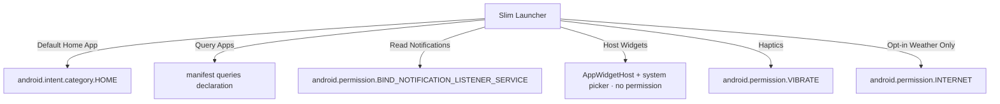

---
tags:
  - architecture
  - android-apis
  - requirements
created: 2026-06-02
status: Draft
---

# System Requirements & API Architecture

This document outlines the core system interactions, APIs, and permission requirements for the **Slim Launcher**. Since a launcher serves as the primary system entry point, it must interface deeply with Android framework components while maintaining a near-zero background footprint.

Back to **[[index|Main Hub]]** | Next: **[[ui_ux_layout|UI/UX Layout & Gesture Mechanics]]**

---

## 🔑 Required Android Permissions

Because the launcher manages app launching, widgets, notifications, and wallpaper styling, it requires several high-priority permissions.



> [!NOTE]
> `INTERNET` is declared solely for the **opt-in** real-weather feature (Open-Meteo). With the default settings, Slim makes zero network calls.

### 1. Home App Intent Handler
In `AndroidManifest.xml`, the main Activity must register as a system home launcher:
```xml
<intent-filter>
    <action android:name="android.intent.action.MAIN" />
    <category android:name="android.intent.category.HOME" />
    <category android:name="android.intent.category.DEFAULT" />
</intent-filter>
```

### 2. App Query & Discovery
- **API**: `android.content.pm.LauncherApps`
- **Visibility**: A `<queries>` declaration for `MAIN`/`LAUNCHER` intents (not the heavy-handed `QUERY_ALL_PACKAGES` permission, which Google Play restricts).
- **Purpose**: Required on Android 11+ (API 30+) to discover and launch installed applications. The launcher must query `LauncherApps.getActivityList(null, user)` to ensure only launchable launcher activities are listed.

### 3. Notification Access
- **Service**: `android.service.notification.NotificationListenerService`
- **Permission**: `android.permission.BIND_NOTIFICATION_LISTENER_SERVICE`
- **Purpose**: Crucial for displaying inline notifications under favorites and performing swipe actions/quick replies directly from the home screen list.

### 4. Widget Hosting
- **API**: `android.appwidget.AppWidgetHost` + `AppWidgetManager`
- **Permission**: **None.** Binding goes through the system widget picker (`ACTION_APPWIDGET_PICK`), which binds the chosen widget on the user's behalf with system privileges. This avoids the signature-level `BIND_APPWIDGET` permission, which only the system/default-configured launcher can hold — so Slim stays installable as an ordinary app.
- **Purpose**: Lets the launcher host and render one standard Android app widget. Implemented in `WidgetHostManager.kt`; see [[settings_and_features#🧩 Home-Screen Widget|Settings & Features → Home-Screen Widget]].

---

## 🏛️ Component Architecture

Slim Launcher is designed with a strict MVVM (Model-View-ViewModel) pattern using Kotlin Flows to push real-time updates.

```
+--------------------------------------------------------+
|                      UI LAYER                          |
|  MainActivity -> RecyclerScroll & WaveGestureView      |
|              -> Floating Search Panel                  |
|              -> WidgetHostManager (AppWidgetHost)      |
|  SettingsActivity -> Feature toggles, About/Contact    |
+--------------------------------------------------------+
                           ^
                           | Observes Flows
                           v
+--------------------------------------------------------+
|                    VIEWMODEL LAYER                     |
|    HomeViewModel (Handles search, selection, filters)  |
+--------------------------------------------------------+
                           ^
                           | Queries/Flows
                           v
+--------------------------------------------------------+
|                   REPOSITORY LAYER                     |
|  AppRepository | SlimPreferences | WeatherService      |
|  NotificationRegistry                                  |
+--------------------------------------------------------+
      ^                  ^                   ^
      | LauncherApps API | AppWidgetHost     | NotificationListener
      v                  v                   v
+--------------------------------------------------------+
|                  SYSTEM SERVICES / DB                  |
|        Android OS & SQLite (Room Cache & Tags)        |
+--------------------------------------------------------+
```

### Data Flow Principles:
1. **Unidirectional Data Flow (UDF)**: The UI fires events (e.g., app launched, search query changed) to the `HomeViewModel`. The ViewModel updates state flows which the UI observes.
2. **Offline Caching**: App lists, search indexes, and custom tag mappings are cached in a SQLite database via **Room**. If `LauncherApps` broadcast indicates package install/removal, the Room cache updates asynchronously.
3. **Lifecycle Awareness**: The `NotificationListenerService` runs as a background service, but communication to the UI is active *only* when the launcher activity is in the foreground (observed via Kotlin StateFlows).

---

## 🪟 Window Focus & ANR Stability

Slim is a **home Activity** (`android.intent.category.HOME`). This makes it special in several ways the system won't save you from:

- The system will **not** show an "App not responding" dialog — it kills and restarts the process directly.
- It is in the critical path of every app-switch, screen-wake, and back-to-home gesture, so any focus-chain disruption hits users constantly rather than occasionally.

The class of ANR that affected Slim historically is `"Input dispatching timed out (Application does not have a focused window)"`. This is distinct from a slow-main-thread ANR: `mCurrentFocus` is correctly set in WindowManager, but InputFlinger's focus token is stale or null. It arises from a **race between a window relayout and InputFlinger's focus assignment**.

### Rules that must be preserved

#### 1. No unnecessary `addFlags` / `clearFlags` in lifecycle callbacks
`window.addFlags()` and `window.clearFlags()` always dispatch a `WindowManager.LayoutParams` change, which propagates through `ViewRootImpl.setLayoutParams()` → `relayoutWindow()` (a synchronous Binder call). If this fires while the focus token is being assigned, InputFlinger may see the window transiently invalid.

**Rule**: Always guard flag mutations with an equality check against the current `window.attributes.flags` before calling. If the bit is already in the target state, return early.

```kotlin
// Correct
val hasFlag = (window.attributes.flags and FLAG_SHOW_WALLPAPER) != 0
if (hasFlag == show) return
if (show) window.addFlags(FLAG_SHOW_WALLPAPER)
else window.clearFlags(FLAG_SHOW_WALLPAPER)
```

#### 2. Never recreate `AppWidgetHostView` on every resume
`AppWidgetHostView` may hold embedded surfaces (for interactive widget content). Calling `container.removeAllViews()` detaches those surfaces and their InputChannels; adding a new view re-creates them asynchronously. The gap creates an InputFlinger focus orphan.

**Rule**: `WidgetHostManager.render()` must track `renderedWidgetId` and skip the destroy/recreate cycle when the widget id is unchanged. Only recreate the view when the bound widget actually changes.

#### 3. Dismiss the IME in `onPause`
If `searchEditText` (or any focusable input) has an open IME connection when the app loses focus, the IME service holds a live `InputConnection` across the focus transition. On screen-wake or app-switch back, the IME's stale token races with WM's new focus grant, producing the same InputFlinger mismatch ANR.

**Rule**: `onPause` must call `imm.hideSoftInputFromWindow(currentFocus?.windowToken, 0)` and `currentFocus?.clearFocus()` unconditionally.

#### 4. No Binder IPC on the main thread in lifecycle callbacks
`PackageManager.resolveActivity()`, `RoleManager.isRoleHeld()`, and similar calls can stall for hundreds of milliseconds on cold system-server paths. In `onResume`/`onWindowFocusChanged`, this directly delays the window's ability to accept input.

**Rule**: All Binder-heavy checks must be dispatched to `Dispatchers.IO`. See `maybePromptDefaultLauncher()` for the canonical pattern.

#### 5. Restore search-panel keyboard state in `onResume`
When the search panel is open and the screen turns off (or power button is pressed), `onPause()` hides the IME but the panel stays visible. On return, the user sees the search bar with no keyboard and no way to type.

**Rule**: `onPause()` must capture `imeWasOpenBeforePause = searchPanel.visibility == VISIBLE && searchEditText.hasFocus()` *before* hiding the IME. `onResume()` then:
- If `imeWasOpenBeforePause == true` (screen-off while typing): defer `requestFocus()` + `showSoftInput` via `post{}` so the window's focus token has settled.
- If `imeWasOpenBeforePause == false` (Home press with panel open): dismiss the search panel silently (`searchPanel.visibility = GONE`).

The `post{}` deferral is essential — firing `showSoftInput` before the window has re-acquired input focus races with WM on aggressive OEM ROMs (ColorOS / Oplus Hans) and silently no-ops or triggers the "no focused window" ANR.

---

## 🔋 Performance & Memory Constraints

> [!WARNING]
> High resource usage will lead to immediate app uninstalls. A custom launcher must run continuously and must not consume unnecessary battery or CPU cycles.

- **Idle RAM Limit**: `< 75 MB`
- **Scrolling Smoothness**: Must target constant `60 FPS` / `90 FPS` / `120 FPS` depending on display hardware.
- **Draw Call Overhead**: Zero allocations in the drawing paths (`onDraw` of `WaveGestureView`).
- **Bitmap Caching**: `AppListAdapter.iconCache` is a bounded `LruCache` (250 entries) rather than an unbounded map, so a device with a very large app list doesn't grow it indefinitely.
- **Clock loop lifecycle**: The header clock/date tick is a self-rescheduling `Handler.postDelayed` runnable (`clockTickRunnable`) started in `onStart()` and stopped in `onStop()` — not a `java.util.Timer`. A `Timer` runs for the entire process lifetime regardless of Activity visibility, which for a launcher that can sit backgrounded for long stretches means a live per-second main-thread post doing nothing useful; it also showed up as "Slow UI thread" time in `dumpsys gfxinfo` competing with input handling. Any other periodic UI work added later should follow this same start/stop-with-lifecycle pattern, not a bare `Timer`.
- **Gesture thresholds are density-scaled**: swipe distance/velocity thresholds in `MainActivity` are computed once from `resources.displayMetrics.density` in `onCreate`, not hardcoded px constants — hardcoded px values are tuned for whatever density they were written on and drift on other screens.

> [!NOTE] OEM background process freezers are a separate failure mode from ANRs
> On OnePlus/Oppo devices (OxygenOS/ColorOS "Hans" process freezer) and similar aggressive-battery-management OEM skins, a backgrounded app — including the default Home app — can be frozen (SIGSTOP-style) even while holding the Home role. The visible symptom (a momentary freeze/grayout right as the launcher resumes) is the OS thawing the process, not a bug in Slim's own code, and `dumpsys gfxinfo`/jank stats won't show it since it happens before the first frame after resume. If a user reports intermittent freezes on resume specifically (as opposed to steady jank during use), check `dumpsys activity processes | grep -A2 com.opscalehub.slim` for `isFrozen`/`isFreezeExempt`, and `dumpsys deviceidle whitelist` for battery-optimization exemption, before assuming a code-side regression. The fix is exempting Slim from battery optimization on-device (Settings → Battery → Battery optimization → Slim → Don't optimize), not something Slim can force programmatically.
