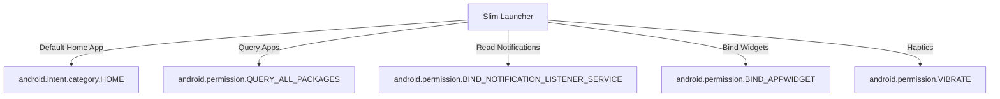

---
tags:
  - architecture
  - android-apis
  - requirements
created: 2026-06-02
status: Draft
---

# System Requirements & API Architecture

This document outlines the core system interactions, APIs, and permission requirements for the **Slim Launcher**. Since a launcher serves as the primary system entry point, it must interface deeply with Android framework components while maintaining a near-zero background footprint.

Back to **[[index|Main Hub]]** | Next: **[[ui_ux_layout|UI/UX Layout & Gesture Mechanics]]**

---

## 🔑 Required Android Permissions

Because the launcher manages app launching, widgets, notifications, and wallpaper styling, it requires several high-priority permissions.



### 1. Home App Intent Handler
In `AndroidManifest.xml`, the main Activity must register as a system home launcher:
```xml
<intent-filter>
    <action android:name="android.intent.action.MAIN" />
    <category android:name="android.intent.category.HOME" />
    <category android:name="android.intent.category.DEFAULT" />
</intent-filter>
```

### 2. App Query & Discovery
- **API**: `android.content.pm.LauncherApps`
- **Permission**: `android.permission.QUERY_ALL_PACKAGES`
- **Purpose**: Required on Android 11+ (API 30+) to discover and launch installed applications. The launcher must query `LauncherApps.getActivityList(null, user)` to ensure only launchable launcher activities are listed.

### 3. Notification Access
- **Service**: `android.service.notification.NotificationListenerService`
- **Permission**: `android.permission.BIND_NOTIFICATION_LISTENER_SERVICE`
- **Purpose**: Crucial for displaying inline notifications under favorites and performing swipe actions/quick replies directly from the home screen list.

### 4. Widget Hosting
- **Service**: `android.appwidget.AppWidgetHost`
- **Permission**: `android.permission.BIND_APPWIDGET`
- **Purpose**: Enables the launcher to host, display, and resize standard Android app widgets.

---

## 🏛️ Component Architecture

Slim Launcher is designed with a strict MVVM (Model-View-ViewModel) pattern using Kotlin Flows to push real-time updates.

```
+--------------------------------------------------------+
|                      UI LAYER                          |
|   MainActivity -> RecyclerScroll & WaveGestureView     |
+--------------------------------------------------------+
                           ^
                           | Observes Flows
                           v
+--------------------------------------------------------+
|                    VIEWMODEL LAYER                     |
|    HomeViewModel (Handles search, selection, filters)  |
+--------------------------------------------------------+
                           ^
                           | Queries/Flows
                           v
+--------------------------------------------------------+
|                   REPOSITORY LAYER                     |
|  AppRepository  |  WidgetRepository  | NotificationRepo |
+--------------------------------------------------------+
      ^                  ^                   ^
      | LauncherApps API | AppWidgetHost     | NotificationListener
      v                  v                   v
+--------------------------------------------------------+
|                  SYSTEM SERVICES / DB                  |
|        Android OS & SQLite (Room Cache & Tags)        |
+--------------------------------------------------------+
```

### Data Flow Principles:
1. **Unidirectional Data Flow (UDF)**: The UI fires events (e.g., app launched, search query changed) to the `HomeViewModel`. The ViewModel updates state flows which the UI observes.
2. **Offline Caching**: App lists, search indexes, and custom tag mappings are cached in a SQLite database via **Room**. If `LauncherApps` broadcast indicates package install/removal, the Room cache updates asynchronously.
3. **Lifecycle Awareness**: The `NotificationListenerService` runs as a background service, but communication to the UI is active *only* when the launcher activity is in the foreground (observed via Kotlin StateFlows).

---

## 🔋 Performance & Memory Constraints

> [!WARNING]
> High resource usage will lead to immediate app uninstalls. A custom launcher must run continuously and must not consume unnecessary battery or CPU cycles.

- **Idle RAM Limit**: `< 75 MB`
- **Scrolling Smoothness**: Must target constant `60 FPS` / `90 FPS` / `120 FPS` depending on display hardware.
- **Draw Call Overhead**: Zero allocations in the drawing paths (`onDraw` of `WaveGestureView`).
- **Bitmap Caching**: Application icons must be loaded asynchronously using a cached pool. Use **Coil** with custom target sizing matching device screen density to prevent OOM (Out Of Memory) errors.
