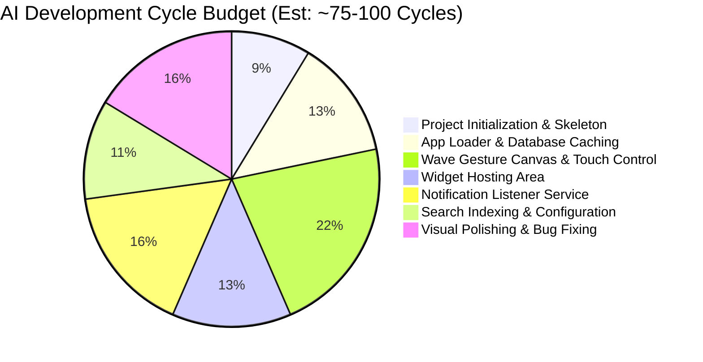

---
tags:
  - estimation
  - ai-development
  - planning
created: 2026-06-02
status: Draft
---

# AI-Led Development Estimation

This document provides a realistic assessment of the time, computational cycles, and collaborative steps needed if **I (the AI agent) handle the development end-to-end**.

Back to **[[index|Main Hub]]** | Previous: **[[subagent_delegation_tasks|Subagent Roles & Prompts]]**

---

## ⚡ The AI Advantage vs. Human Timeline

While a single human developer would take roughly **6 months (~980 hours)** to build, polish, and optimize this launcher, an AI agent working in collaboration with you can drastically compress this timeline.

| Metric | Human Developer | AI Agent (Antigravity) |
| :--- | :--- | :--- |
| **Active Code Generation** | Weeks / Months | Hours (Instantaneous typing) |
| **Error Resolution** | Manual debugging, searching logs | Automated compile-fix loops (seconds) |
| **Calendar Time** | ~6 Months | **2 - 3 Days** (of interactive sessions) |
| **Required User Role** | None (Hands-off) | **Reviewer & Approver** (Running commands, checking UI) |

---

## 📊 Estimated Interaction Cycles & Flow

An "Interaction Cycle" represents a model turn (thinking -> tool call to modify code/compile -> tool result -> evaluation).



### Breakdown of AI Cycle Steps

1. **Phase 1: Project Initialization & Build Setup (Est: 8 Cycles)**
   - Initialize Gradle project, declare dependencies (Jetpack Compose, Room, Hilt, Coil, Core KTX).
   - Write basic Manifest, home activity mappings, launcher categories.
   - *User input*: Reviewing and approving initial Gradle build execution.

2. **Phase 2: App Listing & Caching (Est: 12 Cycles)**
   - Create data layer queries via `LauncherApps`.
   - Write Room schemas and indexing models.
   - Expose package streams to UI `RecyclerView`.
   - *User input*: Approving execution of app loader integration test.

3. **Phase 3: Wave Alphabet Slider (Est: 20 Cycles)**
   - Custom `WaveGestureView` draw implementation and trigonometry functions.
   - Sync scroll listener to slide layout indexes.
   - *User input*: High visual involvement. The user provides feedback on screen captures generated via `adb shell screencap` to fine-tune letter curves.

4. **Phase 4: Widget Hosting & Config (Est: 12 Cycles)**
   - Write widget binding adapter class and hosting frames.
   - Handle permissions flows and error rebounds.

5. **Phase 5: Notification Service (Est: 15 Cycles)**
   - Setup `NotificationListenerService` and permission prompts.
   - Write flow collectors updating home lists.

6. **Phase 6: Search & Preferences UI (Est: 10 Cycles)**
   - Implementation of keyboard popup settings, query matching.

7. **Phase 7: Polish & Profiling (Est: 15 Cycles)**
   - Profiling memory allocations, fixing frame drops, verifying memory stability.

---

## 🎯 Verification Protocols (AI-Led Code Validation)

To ensure the generated code is robust and does not crash, the AI relies on a **Triple-Lock Validation Loop**:

```
[Write Code] 
     │
     ▼
[Step 1: Compiler Lock] ──► Runs './gradlew compileDebugKotlin' to catch compile-time syntax errors.
     │
     ▼
[Step 2: Static Analysis] ──► Runs Lint rules to locate memory leaks, resource leaks, or missing APIs.
     │
     ▼
[Step 3: Headless UI Validation] ──► Deploys via ADB, takes screenshots, uses Vision models to check UI layouts.
```

---

## 🚦 Pre-requisites for the User
To start the AI-led development process, please verify your environment supports the following tools:
1. **Android SDK & Build Tools**: Installed locally on this environment, with paths configured (`ANDROID_HOME`).
2. **Gradle**: Wrapper scripts configured (`./gradlew` setup).
3. **Connected Device/Emulator**: An active device connected via USB or an active Android Virtual Device (AVD) running on localhost, reachable by `adb devices`.
